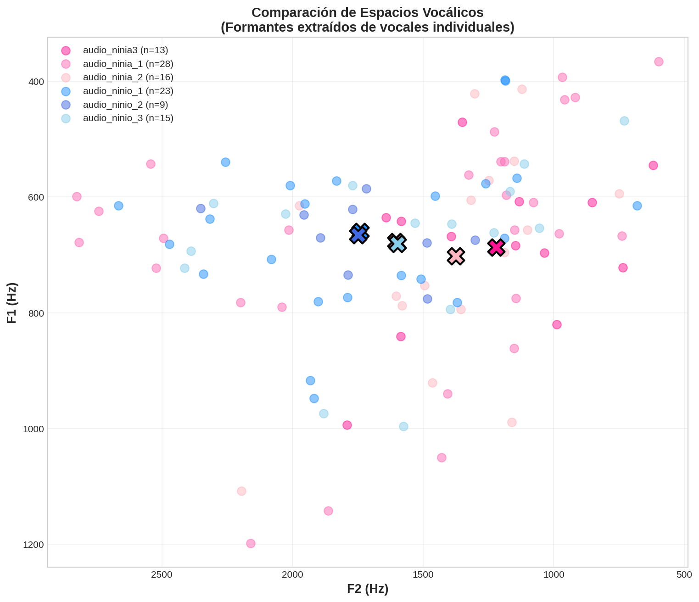
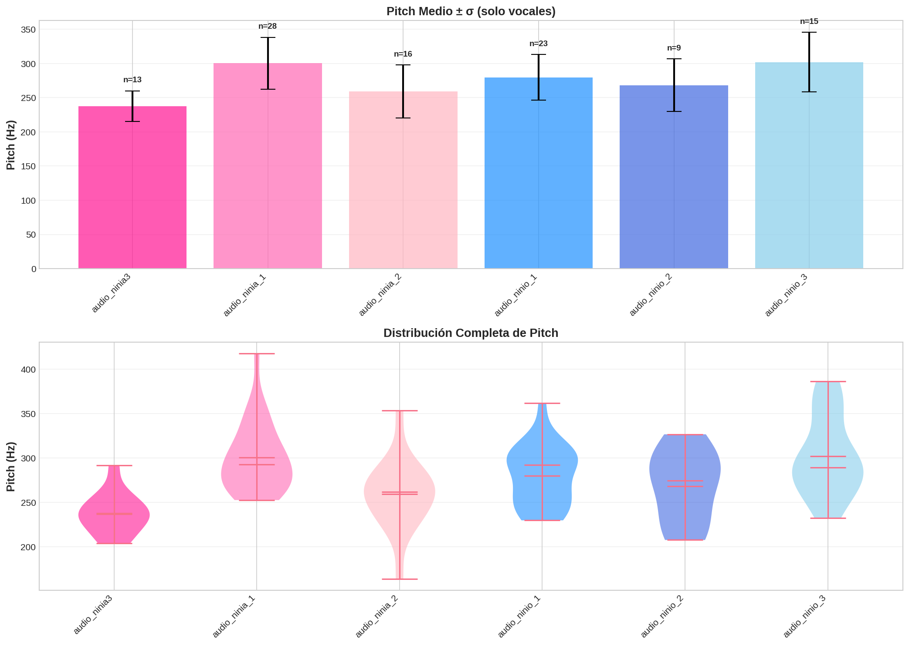

# ¿Niño o niña? La percepción del género en las voces infantiles

---

## Actividad inicial: ¿Quién está hablando?

Escuchad estas voces y responded: **¿es un niño o una niña?**

### Audio 1
🔊 *[Se reproduce audio_ninio_2.wav]*

### Audio 2
🔊 *[Se reproduce audio_ninia_1.wav]*

### Audio 3
🔊 *[Se reproduce audio_ninio_3.wav]*

### Audio 4
🔊 *[Se reproduce audio_ninia3.wav]*

### Audio 5
🔊 *[Se reproduce audio_ninio_1.wav]*

### Audio 6
🔊 *[Se reproduce audio_ninia_2.wav]*

**Pregunta:** ¿Habéis podido identificar el género de cada voz? ¿Con qué grado de certeza?

---

## El enigma científico

### Lo que dice la investigación

Según Funk & Simpson (2023), podemos identificar el género de voces infantiles con una **precisión del 70-84%**, pero:

> *"Las diferencias anatómicas entre niños y niñas antes de la pubertad son prácticamente inexistentes"*
>
> — Fitch & Giedd (1999)

**Entonces, ¿cómo lo hacemos?**

---

## Nuestro análisis: los datos acústicos

### Métricas extraídas de las grabaciones

| Grabación | Palabras | Vocales | Pitch (Hz) | F1 (Hz) | F2 (Hz) | F3 (Hz) |
|-----------|----------|---------|------------|---------|---------|---------|
| Niña 1 | 4 | 28 | **300±38** | 678±206 | 1603±682 | 2918±494 |
| Niña 2 | 1 | 16 | **259±39** | 702±186 | 1376±339 | 2568±583 |
| Niña 3 | 3 | 13 | **238±23** | 687±130 | 1220±356 | 2844±633 |
| Niño 1 | 7 | 23 | **280±34** | 660±132 | 1741±494 | 2697±406 |
| Niño 2 | 2 | 9 | **268±39** | 666±57 | 1750±292 | 2879±500 |
| Niño 3 | 5 | 15 | **302±44** | 681±140 | 1598±501 | 2800±573 |

### Observación clave
Los rangos se **solapan completamente**. No hay diferencias estadísticamente significativas.

---

## Entendiendo la acústica de la voz

### ¿Qué son estos parámetros?

#### **Pitch (frecuencia fundamental, F₀)**
- La "altura" de la voz (grave o aguda)
- Producido por la vibración de las cuerdas vocales
- En niños prepuberales: **200-350 Hz** (similar en ambos sexos)
- Para comparar: adultos varones ~120 Hz, mujeres adultas ~220 Hz

#### **Formantes (F1, F2, F3)**
- Frecuencias de resonancia del tracto vocal
- Determinan la **calidad** de las vocales (/a/, /e/, /i/, /o/, /u/)
- Relacionados con la **longitud del tracto vocal**

**F1:** apertura de la boca (bajo = cerrada /i/, alto = abierta /a/)
**F2:** posición de la lengua (bajo = posterior /u/, alto = anterior /i/)
**F3:** configuración más compleja del tracto vocal

---

## Visualización de los resultados

### Espacio vocálico F1-F2

**Interpretación:** Las elipses muestran la distribución de las vocales de cada hablante. El solapamiento es evidente.

### Distribución del pitch

**Interpretación:** Las barras de error muestran que los rangos de pitch son muy similares entre niños y niñas.

---

## La paradoja: ¿cómo diferenciamos entonces?

### Lo que las referencias nos dicen

#### Barreda & Assmann (2021)
> *"La percepción del género y la edad del hablante están **entrelazadas**. Los oyentes usan información sobre la edad para informar sus juicios de género"*

**Implicación:** No basta con analizar la voz en un momento puntual. El contexto y las expectativas importan.

#### Funk & Simpson (2023)
Identificaron varios factores clave:

1. **Pitch como predictor principal** (aunque con mucho solapamiento)
2. **Espectro de sibilantes** (/s/, /z/): los niños tienden a producirlas con energía más baja
3. **Correlación con conformidad de género**: Los niños que expresan mayor conformidad con estereotipos de género muestran diferencias más marcadas

---

## La respuesta: no es solo la anatomía

### Tres factores que explican la percepción

#### 1. **Diferencias comportamentales (conductuales)**
- Desde los 2-3 años, los niños internalizan estereotipos de género
- Pueden **modificar voluntariamente** su voz para sonar más "masculinos" o "femeninos"
- Cartei et al. (2019): niños de 6-10 años pueden controlar la expresión de masculinidad/feminidad en su voz

#### 2. **Información prosódica**
- Patrones de entonación
- Ritmo del habla
- Variabilidad temporal y espectral
- **Mucho más evidente en frases completas que en sílabas aisladas**

#### 3. **Información contextual**
- Duración del estímulo (mejor en oraciones que en vocales aisladas)
- Conocimiento de la edad aproximada del hablante
- Expectativas culturales

---

## Conclusiones: lo aprendido

### 1. Las diferencias acústicas prepuberales son sutiles
- No hay dimorfismo sexual anatómico significativo antes de la pubertad
- Los parámetros acústicos básicos (pitch, formantes) **se solapan completamente**

### 2. Pero la percepción es robusta
- Identificamos correctamente el género en ~70-80% de los casos
- La precisión mejora con más contexto (oraciones vs sílabas aisladas)

### 3. La voz como práctica social
- Los niños **aprenden y practican** patrones de habla asociados a su género
- La voz no solo refleja anatomía, sino **identidad de género**
- Esto tiene implicaciones importantes:
  - Desarrollo del lenguaje
  - Identidad de género en la infancia
  - Terapia de voz para niños con disforia de género

---

## Reflexión final

### La pregunta no es solo "¿cómo diferenciamos?"

**Es también:** ¿Qué nos dice esto sobre cómo se construye el género?

La voz infantil nos muestra que el género **no es solo biología**:
- Es **performativo**: se practica y se expresa
- Es **perceptivo**: lo interpretamos con expectativas culturales
- Es **dinámico**: evoluciona con el desarrollo

> *"A pesar de que las diferencias anatómicas no son significativas, podemos percibir diferencias entre las voces de niños y niñas porque estos transmiten información sobre su identidad de género a través de patrones de articulación aprendidos"*

---

## Referencias principales

**Barreda, S., & Assmann, P. F. (2021).** Perception of gender in children's voices. *Journal of the Acoustical Society of America*, 150(5), 3949-3963.
- Demuestra que la percepción de género y edad están entrelazadas
- Los oyentes usan información de edad de forma dependiente del contexto

**Funk, R., & Simpson, A. P. (2023).** The acoustic and perceptual correlates of gender in children's voices. *Journal of Speech, Language, and Hearing Research*, 66, 3346-3363.
- Pitch como predictor principal, pero no único
- Correlación con conformidad de género autorreportada
- Importancia de los espectros de sibilantes

**Cartei, V., et al. (2019).** Children can control the expression of masculinity and femininity through the voice. *Royal Society Open Science*, 6(7), 190656.
- Los niños pueden modificar voluntariamente su voz
- Evidencia directa de la naturaleza performativa del género en la voz

---

## Metodología del análisis

### Rigor científico en nuestro estudio

✅ **Segmentación automática en palabras** (detección de silencios)
✅ **Detección de vocales individuales** (pitch + energía)
✅ **Formantes extraídos solo del punto medio** de vocales (donde son estables)
✅ **Pitch calculado solo en segmentos sonoros** (Voice Activity Detection)
✅ **Incertidumbre reportada** con desviación estándar (±σ)

### Por qué esto importa

❌ NO promediamos formantes sobre frases completas → no tiene significado fonético
❌ NO calculamos pitch en consonantes sordas → distorsiona los resultados
❌ NO reportamos valores sin incertidumbre → no es científico

---

## Preguntas para el debate

1. ¿Creéis que los niños son conscientes de que modifican su voz para sonar más "masculinos" o "femeninos"?

2. Si las diferencias anatómicas son mínimas, ¿de dónde aprenden los niños estos patrones vocales?

3. ¿Qué implicaciones tiene esto para nuestra comprensión del género como constructo social vs biológico?

4. ¿Debería esto cambiar nuestra aproximación a la terapia de voz para niños transgénero?

---

## ¡Gracias por vuestra atención!

### Materiales disponibles
- Código del análisis: `analyze_voices_rigorous.py`
- Datos: `metricas_rigurosas.csv`
- Visualizaciones: carpeta del repositorio
- Referencias completas en el README

**Contacto y preguntas:**
[vuestro email/información de contacto]
